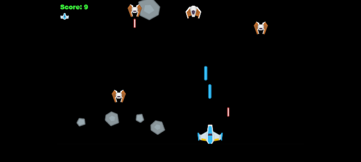
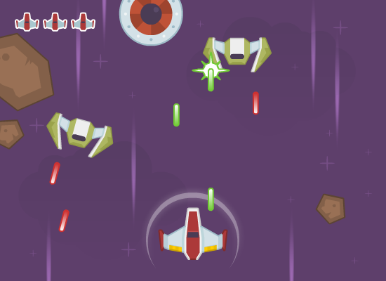

# Table of content

1. [Table of content](#table-of-content)
2. [About](#about)
3. [Project goals](#project-goals)
4. [Style](#style)
   1. [Main menu](#main-menu)
   2. [Gameplay scene](#gameplay-scene)
   3. [References](#references)
5. [Mechanics](#mechanics)
   1. [Key binding](#key-binding)
   2. [Game characteristic values](#game-characteristic-values)
   3. [Player movement](#player-movement)
   4. [Asteroid movement](#asteroid-movement)
   5. [Asteroid spawning](#asteroid-spawning)
   6. [Shooting](#shooting)
   7. [Collision](#collision)
   8. [Health system](#health-system)
   9. [Score counting](#score-counting)
   10. [Saving of best result](#saving-of-best-result)
6.  [Used resources](#used-resources)
7.  [Results](#results)

# About
- Program type: game;
- Genre: space-shooter;
- Engine: [Bevy](https://bevy.org/)
- Platform: Windows.

# Project goals
1. Gain knowledge and practice in the Rust language and the use of the ECS architecture pattern in game development.
2. Develop a simple 2D space shooter game.

# Style
It's 2D game in casual style. The game has a main menu and a gameplay scene.
1. **Player** - a spacecraft that can shoot lasers;
2. **Asteroid** - an enemy of the player. The player have to destroy it with his laser.

## Main menu
In the main menu there are a button **"Start game"** which you can press to go to the **Gameplay scene** and a button **"Exit"** which you can press to exit the game. 
There is also a best score text label that displays your best score in the game.

## Gameplay scene
In the gameplay, the player is at the bottom of the screen, and the asteroids are moving at us from top to bottom. 
The upper left corner of the screen displays the amount of health of the player. In the upper right corner is the current score.

## References

---

# Mechanics
1. - [ ] Player movement
2. - [ ] Asteroid movement
3. - [ ] Asteroid spawning
4. - [ ] Shooting
5. - [ ] Collision
6. - [ ] Health system
7. - [ ] Score counting
8. - [ ] Saving of best result

## Key binding
| Action     |  Key  |
| :--------- | :---: |
| Move left  |   A   |
| Move right |   D   |
| Shoot      | Space |

## Game characteristic values
| Characteristic        | Value |
| :-------------------- | :---: |
| Player speed          |   1   |
| Asteroid speed        |   1   |
| Laser speed           |   1   |
| Amount of health      |   3   |
| Damage of asteroid    |   1   |
| Shooting rate         |  0.2  |
| Asteroid spawn rate   |   3   |
| Score by one asteroid |   1   |

## Player movement
When player click **[Move left]** or **[Move right]** then the player moves in the corresponding direction with the speed ***[Player speed]***.

## Asteroid movement
The asteroid moves from top to bottom at a constant speed ***[Asteroid speed]***.

## Asteroid spawning
Asteroids appear at the top of the screen with a ***[Asteroid spawn rate]***.

## Shooting
When the player press **[Shoot]** action then a laser is created at the end of the ship and moves at a constant speed ***[Laser speed]***. The player can shoot with a certain time interval ***[Shooting rate]***.

## Collision
The player, lasers and asteroids must collide with each other as well as with the edges of the screen.

## Health system
When an asteroid collides with the player's ship or the bottom of the screen, the player is damaged and loses health by ***[Damage of asteroid]***. 
When the health is 0, then the game is over.

## Score counting
When the player destroy an asteroid by laser his get ***[Score by one asteroid]***.

## Saving of best result
When the game ends, the result is saved if it is a record.

# Used resources
1. [Game engine Bavy](https://bevy.org/)
2. [Space Shooter Redux by KenneY](https://kenney.nl/assets/space-shooter-redux)

# Results
Work in progress.
